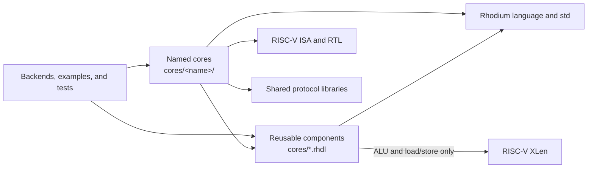

<!-- Defines ownership and dependency boundaries for reusable processor components and named cores. -->

# Processor components and cores

Use `cores/` for processor RTL, not for Rhodium's language internals. The
similarly named [`rhodium/core/`](../rhodium/core/README.md) owns the
frontend-independent hardware IR.

## Choose the right home

Before adding a component, decide who owns its policy:

- Put an execution or data-shaping block directly under `cores/` only when its
  interface is useful to more than one processor and it does not depend on an
  instruction catalog, named core, backend, example, or test.
- Put instruction decode, architectural state, pipeline policy, adapters, and
  integrated tests under `cores/<name>/`.
- Put direct tests for a reusable component in [`cores/tests/`](tests/). Put a
  named core's tests under its own `tests/` directory.

The boundary is enforced by [`check-boundaries.sh`](check-boundaries.sh). A
reusable component may use the closed RISC-V `XLen` configuration when its
contract is specifically RV32/RV64, but instruction catalogs and field models
remain named-core policy.

## Pick a reusable component

All reusable blocks expose already-decoded physical controls. Their callers own
instruction recognition, operand selection, pipeline scheduling, and
architectural result selection.

| Component | Interface and parameters | Timing contract | Component owns | Caller owns |
|---|---|---|---|---|
| [`ALU(xlen)`](alu.rhdl) | `XLen.X32` or `XLen.X64`; `left`, `right`, and `AluControl` to `result` | Combinational; no ready/valid state | Modular arithmetic, logic, shifts/rotates, comparisons, counts, unary transforms, RV64 word shaping, and the shared Zba/Zbb/Zbs/Zicond datapaths | Decode, operand routing, and result use |
| [`BranchResolver(width)`](branch-resolver.rhdl) | `Valid(BranchResolverRequest)` to `Valid(BranchResult)` | Combinational; output validity follows input validity, with no backpressure | Equal and signed/unsigned less-than comparison plus final `taken` selection | Encodings, target generation, PC state, and redirect timing |
| [`LoadGen(xlen, beat_bytes = 8)`](load-store.rhdl) | Address, returned beat, `MemoryWidth`, and signedness to one XLEN value | Combinational; the power-of-two beat must contain an XLEN word | Addressed scalar extraction and sign/zero extension | Beat-address alignment, access validation, protocol, and ordering |
| [`StoreGen(xlen, beat_bytes = 8)`](load-store.rhdl) | Address, XLEN value, and `MemoryWidth` to beat data and `Mask(beat_bytes)` | Combinational; the power-of-two beat must contain an XLEN word | Addressed scalar placement and byte-lane mask generation | Beat-address alignment, access validation, protocol, and ordering |
| [`IterativeMultiplier(width)`](multiplier.rhdl) | `Decoupled(MultiplierRequest)` to an `Irrevocable` double-width product | One request at a time; consumes one multiplier bit per cycle; response stays stable until accepted; may replace a response as it is consumed | Signed/unsigned magnitude handling and the complete product | Low/high/word projection and architectural destination |
| [`IterativeDivider(width)`](divider.rhdl) | `Decoupled(DividerRequest)` to an `Irrevocable(DividerResponse)` | One request at a time; resolves one quotient bit per cycle; response stays stable until accepted; may replace a response as it is consumed | Quotient, remainder, divide-by-zero, and fixed-width signed-overflow behavior | Quotient/remainder/word projection and architectural destination |

`MemoryWidth.is_aligned(address)` checks the same byte, halfword, word, or
doubleword size contract used by the load/store generators. The generators do
not suppress misaligned requests; invoke the helper or perform an equivalent
check before issuing one.

For both iterative engines, a request transfers only when `request.fire()` is
true. The `Irrevocable` response may be backpressured and must be consumed with
`response.fire()`. This interface deliberately leaves queueing, cancellation,
destination tracking, and writeback policy outside the reusable block.

## Add or inspect a named core

Create `cores/<name>/` and keep its decode, datapath, architectural state,
integration adapters, and tests together. A named core may depend on the
reusable blocks, Rhodium libraries, pure RISC-V ISA/RTL support, and shared
protocol libraries, but never on another named core.

RV5Stage is the current named core. Its default profile is integer-only;
supported optional profiles are RV32F on `XLen.X32` and RV64D on `XLen.X64`,
with the D profile also implementing F. RV32D and an RV64F-only specialization
are rejected. Compressed instructions independently select no support, Zca, or
the FP-profile-dependent C composition. See [`rv5stage/README.md`](rv5stage/README.md) for the owned
instruction families, pipeline and completion contracts, FP state and
execution, memory hierarchy, CHI boundary, generator parameters, ports, tests,
and deliberate limits.

## Preserve dependency direction



Production code must not reverse an arrow toward consumers. In particular,
neither reusable components nor named cores may import the optional CIRCT
backend, examples, or tests. Backend consumers elaborate public designs from
outside this package.

## Verify a change

Run commands from the repository root. For a reusable component, start with
its direct host test:

```sh
tools/run-racket-tests.sh cores/tests/alu-test.rhm
tools/run-racket-tests.sh cores/tests/branch-resolver-test.rhm
tools/run-racket-tests.sh cores/tests/load-store-test.rhm
tools/run-racket-tests.sh cores/tests/multiplier-test.rhm
tools/run-racket-tests.sh cores/tests/divider-test.rhm
```

Run only the line for the component you changed, or pass several paths to one
invocation when a contract spans components. The script supplies a fresh
`PLTCOMPILEDROOTS` when the caller has not already selected one.

After changing imports, ownership, or package layout, run:

```sh
bash cores/check-boundaries.sh
```

For work that crosses reusable components and RV5Stage integration, the root
[`Makefile`](../Makefile) provides:

```sh
make rv5stage-host-test
```

Use `make rv5stage-test` only when the change also needs the focused CIRCT and
Verilator fixtures. The named core's owning README describes narrower RV5Stage
test selections.
