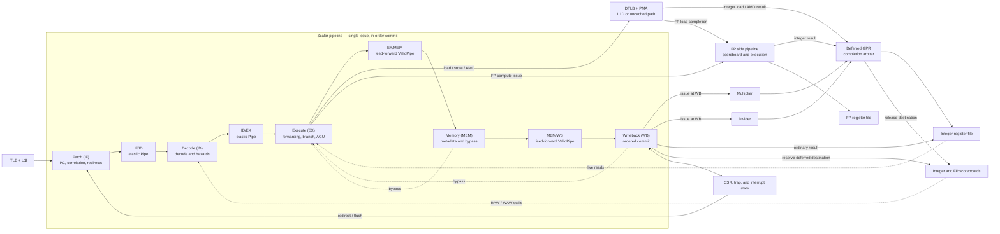
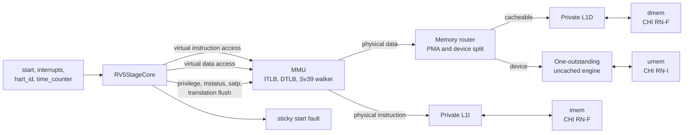

<!-- Defines RV5Stage's microarchitecture, system boundary, implementation ownership, and verification workflow. -->

# RV5Stage

RV5Stage is a single-issue, in-order, five-stage RISC-V processor implemented
as direct Rhodium RTL. A required `xlen :: XLen` host parameter selects RV32 or
RV64 without admitting arbitrary integer widths. Optional floating-point
profiles specialize the same scalar pipeline with a parallel FP execution
backend.

Core-specific decode, architectural state, pipeline policy, MMU, and private L1
caches live here. Reusable execution components remain directly under
[`cores/`](../).

## At a glance

| Property | Contract |
|---|---|
| Pipeline | Fetch, Decode, Execute, Memory, Writeback |
| Issue and retirement | Single issue; ordered WB commit |
| Pipeline boundaries | Elastic IF/ID and ID/EX; feed-forward EX/MEM and MEM/WB |
| Deferred work | Loads, atomics, multiply, divide, and FP results may complete after their scalar token retires |
| Integer widths | RV32 and RV64 selected by `XLen.X32` or `XLen.X64` |
| Floating point | Disabled by default; RV32F or RV64D, with D including RV64F |
| Address translation | Bare for RV32; Bare or Sv39 for RV64 |
| Private caches | Separate configurable L1I and blocking write-back L1D; fixed 64-byte lines |
| External memory | Separate instruction and data CHI RN-F channels plus a device RN-I channel |

Implemented instruction families include RV32I/RV64I, A, B, M, Zicond,
Zicsr, Zicntr, and Zifencei. The privileged control plane implements an initial
M/S/U slice. RV32D and an RV64F-only specialization are deliberately rejected.

## Microarchitecture

The five logical stages are regions of one [`RV5StageCore`](core.rhdl) circuit,
not module boundaries. Instructions issue and commit in order, while selected
register-producing operations may complete later through explicit scoreboards
and a completion arbiter.



### Stage contract

| Region | Output boundary | May hold? | Primary responsibility |
|---|---|---:|---|
| Fetch | IF/ID `Pipe` | Yes | PC generation, L1I request correlation, and redirect flushing |
| Decode | ID/EX `Pipe` | Yes | Structured decode, serialization, and RAW/WAW hazard checks |
| Execute | EX/MEM `ValidPipe` | Before transfer | Live operand reads, forwarding, ALU, branch resolution, address generation, and synchronous-fault classification |
| Memory | MEM/WB `ValidPipe` | No | Feed-forward metadata, bypass, and cache-response alignment |
| Writeback | Ordered commit | At defined architectural waits | Register and CSR effects, traps, fences, and deferred-destination reservation |

Fetch retains accepted PCs in a two-entry flushable metadata queue so the
pipelined L1I can accept and return one hit per cycle. Redirects flush the PC
queue, active lookup result, and buffered responses. A wrong-path refill may
finish internally but cannot return an instruction to Fetch.

Decode holds an instruction before Execute until its operands are available and
the required execution or cache resource can accept it. ID/EX stores register
indices rather than captured values; Execute reads the integer register file
live and applies MEM and WB forwarding. This lets a held instruction observe a
write after the ordinary forwarding window has passed.

Once Execute transfers an instruction into EX/MEM, no later scalar stage can
backpressure it. Branch resolution, synchronous-fault classification, and any
legal memory-request acceptance occur on that transfer. L1D's registered SRAM
result is aligned with the instruction at WB.

WB is the sole ordered architectural commit point. A deferred instruction may
reserve its destination and release the scalar pipeline before its value
returns. Younger independent instructions can then complete first, but they
still issue through the ordered scalar pipeline. This is in-order issue and
commit with out-of-order register completion, not out-of-order execution.

## Execution and completion

| Result class | Dispatch point | Completion path |
|---|---|---|
| Integer ALU, branch link, immediate, and ordinary CSR result | Scalar pipeline | Ordinary WB register-file port |
| Load or atomic result | Memory request accepted in EX | L1D/uncached response to deferred completion arbiter |
| Multiply or divide | Reserved in EX; issued only at WB | Deferred completion arbiter |
| FP result targeting an integer register | FP request accepted from EX | FP completion to deferred completion arbiter |
| FP result targeting an FP register | FP request accepted from EX | FP pipeline's internal FP register-file port |
| FP load | Memory request accepted in EX | Memory response to FP pipeline's load port |

The fixed-priority deferred arbiter gives loads priority because their response
cannot be backpressured. Multiplier, divider, and FP integer responses remain
stable until selected. Its output drives the second integer register-file write
port and clears the corresponding scoreboard entry. The ordinary WB result uses
the other write port. WAW gating prevents both ports from targeting the same
register in one cycle, and a WB-aligned cache hit can set and clear a destination
without an extra busy cycle.

The optional [`fp-pipeline.rhdl`](fp-pipeline.rhdl) backend owns the FP register
file, FP RAW/WAW scoreboard, operand reads, a two-cycle fixed-latency path,
buffered divide/square-root paths, and completion arbitration. FP compute
requests dispatch irrevocably from EX while their scalar tokens continue to WB.
Accepted requests are non-speculative and must eventually complete. FP state
updates accrue exception flags and mark `mstatus.FS` dirty.

FP loads and stores share the scalar address generator, MMU, PMA checks, ordered
L1D, and uncached path. An FP load reserves its destination when the legal memory
request is accepted. An FP store holds EX for the FP register file's one-cycle
store-data response before issuing the ordinary memory request. The cache data
path remains XLEN-wide because supported RV32 FP accesses are single precision
and RV64D uses a 64-bit XLEN.

## Control, hazards, and ordering

Decode stalls on scoreboard RAW and WAW hazards and on direct conflicts with
deferred instructions still crossing ID/EX or EX/MEM. Independent younger
instructions may proceed while a load, multiply, divide, or FP result remains
outstanding. D-cache responses are ordered, and a blocking miss prevents younger
memory requests from entering the cache even when non-memory work can pass it.

The structured decoder selects the integer-only, RV32F, or RV64D control catalog
at host elaboration and emits component control bundles through one hardware
decode relation. It does not introduce an instruction-kind enum or parallel
runtime decoders. Unused controls remain synthesis don't-cares behind a separate
valid bit.

Standard B and Zicond operations reuse the shared combinational
[`ALU`](../alu.rhdl). Zba, Zbb, Zbs, and Zicond add no second decoder, execution
unit, pipeline state, reservation, or scoreboard path. A operations use the
semantic memory machinery in [`memory.rhdl`](memory.rhdl) and return through the
same deferred path as loads.

CSR instructions return the old value and update state atomically at WB. System
instructions serialize in Decode and wait for older deferred work before
entering the pipeline. Execute-detected exceptions squash younger work and carry
the faulting instruction to WB, where CSR state records EPC, cause, and trap
value. Eligible interrupts stop Fetch and Decode, drain accepted scalar and
deferred work, and enter the trap after the last retired instruction. `WFI` is a
serialized legal no-op in this implementation.

`FENCE`, `FENCE.I`, and `SFENCE.VMA` share the serialization boundary. Decode
waits for older deferred completions and L1D quiescence, then prevents younger
instructions from entering Execute until the fence reaches WB. `FENCE.I` also
invalidates L1I and redirects Fetch to the fence's `pc + 4`; speculative fetch
flush and architectural cache invalidation remain distinct operations.

## System-facing composition

[`rv5stage.rhdl`](rv5stage.rhdl) wraps `RV5StageCore` with address translation,
physical-region routing, private caches, and CHI transaction boundaries:



`RV5StageCHIConfig` supplies the flit shape and a single list of physical
regions paired with CHI Homes. From that list it derives both the RISC-V
physical-memory map and `CHIHomeMap`, preventing permissions, cacheability, and
CHI routing from describing different address ranges. Cache transactions decode
their address once and retain the selected HN-F NodeID through retry, data, and
completion acknowledgement.

`RV5StageCHIParams` contains host-only placement metadata for instruction and
data RN-F NodeIDs and the optional device RN-I NodeID. An occurrence receives
those values through `RV5StageCHIIdentity` hardware inputs, allowing one
specialized core definition to be stamped at multiple placements.

### Generator parameters

| Parameter | Meaning |
|---|---|
| `xlen` | Required `XLen.X32` or `XLen.X64` architectural width |
| `~floating_point` | `None`, RV32F, or RV64D-compatible FP profile |
| `~icache` | L1I set and way geometry; defaults to `RV5StageCacheConfig(64, 1)` |
| `~dcache` | L1D set and way geometry; defaults independently to `RV5StageCacheConfig(64, 1)` |
| `~chi` | Required physical flit, address-region, and Home-routing policy |

Cache line size is fixed at 64 bytes and is not a generator parameter. Each
cache SRAM row and core lookup is XLEN-wide. RV5Stage uses CHI's minimum 128-bit
DAT width, so a line refill contains four DAT packets and installs over eight
RV64 or sixteen RV32 SRAM writes.

### Top-level ports

| Port | Contract |
|---|---|
| `start` | `Irrevocable(Bits(xlen.width))` reset PC consumer |
| `interrupts` | Controller-independent supervisor and machine software, timer, and external interrupt levels |
| `hart_id` | Platform hart identity exposed through `mhartid` |
| `time_counter` | Platform 64-bit time source exposed through `time` and RV32 `timeh` |
| `imem` | Instruction-cache CHI RN-F channels |
| `dmem` | Data-cache CHI RN-F channels |
| `umem` | Uncached device CHI RN-I channels |
| `fault` | Sticky rejection of a misaligned external start address |

Home Nodes, physical credited links, fabric topology, interrupt controllers,
and SoC policy remain outside RV5Stage.

## Memory hierarchy

RV64 supports Bare and Sv39 translation ahead of physically indexed,
physically tagged L1 caches; RV32 remains Bare. Separate eight-entry fully
associative ITLB and DTLB instances retain PTE permissions and recheck current
privilege, `SUM`, and `MXR`. A single non-speculative walker services one miss at
a time through the physical L1D path after older cache work drains. See the
[`MMU contract`](mmu/README.md) for translation, permission, and fault ownership.

L1I is a clean-only, one-hit-per-cycle instruction cache with flushable lookup
and response state. L1D is a blocking write-back/write-allocate cache supporting
loads, stores, LR/SC, and AMOs. Physical device regions bypass L1D through a
one-outstanding uncached engine; unmapped, denied, or device-atomic requests
fault locally instead of entering CHI.

The parent core owns only integration-level ordering. Array organization,
replacement, refill, dirty writeback, snoop behavior, DVM handling, and CHI
response stability are specified by the subsystem documents:

- [`icache/README.md`](icache/README.md) — instruction protocol and clean L1I
- [`dcache/README.md`](dcache/README.md) — data protocol and write-back L1D
- [`mmu/README.md`](mmu/README.md) — Sv39 translation and L1D walker arbitration
- [`refill.rhdl`](refill.rhdl), [`write-unique.rhdl`](write-unique.rhdl),
  [`writeback.rhdl`](writeback.rhdl), and [`snoop.rhdl`](snoop.rhdl) — shared CHI
  transaction engines

## Privileged and architectural state

[`csr.rhdl`](csr.rhdl) owns user, machine, and supervisor CSRs, current
privilege, trap entry, interrupt selection, and `MRET`/`SRET`. FP profiles add
the aliased `fflags`, `frm`, and `fcsr` views, `mstatus.FS` state, and derived
`SD`. The `csr_bank` declaration is the single source for recognized IDs, read
values, storage, aliases, WARL masks, and ordinary write dispatch.

The core consumes controller-independent interrupt levels defined by
[`interrupt.rhdl`](interrupt.rhdl). CSR state combines them with writable
pending bits and applies enables, delegation, privilege, and architectural
priority. Reusable 64-bit `mcycle` and `minstret` state supplies Zicntr views;
`minstret` advances only when an instruction reaches WB without a synchronous
exception.

## Implementation map

| Area | Ownership |
|---|---|
| [`rv5stage.rhdl`](rv5stage.rhdl) | Core, MMU, cache, uncached, and CHI composition |
| [`core.rhdl`](core.rhdl) | Scalar pipeline, forwarding, hazards, commit, and deferred completion |
| [`bundles.rhdl`](bundles.rhdl) | Scalar pipeline payloads |
| [`decode/`](decode/README.md) | Structured integer and FP control generation |
| [`register-file.rhdl`](register-file.rhdl) | Two-read, two-write integer register bank |
| [`fp-pipeline.rhdl`](fp-pipeline.rhdl) | FP register state, execution lanes, and completion |
| [`csr.rhdl`](csr.rhdl), [`interrupt.rhdl`](interrupt.rhdl) | Privileged state, traps, counters, and interrupts |
| [`mmu/`](mmu/README.md) | TLBs, translation, and page-table walking |
| [`memory-router.rhdl`](memory-router.rhdl), [`uncached.rhdl`](uncached.rhdl) | Physical-region routing and device transactions |
| [`icache/`](icache/README.md), [`dcache/`](dcache/README.md) | Private cache protocols, arrays, policy, and CHI routing |
| Transaction engines | Refill, ownership acquisition, retry, dirty drain, and snoop handling |

RV5Stage may depend on Rhodium, the pure RISC-V model, reusable components from
`cores/`, and shared CHI libraries. It must not import another named core, a
backend, examples, or test implementations.

## Generated detailed diagrams

The embedded diagrams describe architectural intent. For an implementation
inventory of the elaborated RV64 core, including child blocks, registers, and
typed interface channels, generate JSON and Graphviz DOT from
[`examples/rv5stage/core-diagram.rhdl`](../../examples/rv5stage/core-diagram.rhdl):

```sh
mkdir -p /tmp/rv5stage-core-diagram
env PLTCOMPILEDROOTS="$(mktemp -d)" \
  racket -y -S "$PWD" tools/write-rv5stage-core-diagram.rhm \
  /tmp/rv5stage-core-diagram
```

The JSON targets interactive renderers. The compact DOT view links child
modules by name rather than flattening their internals into one graph.

## Verification

Run the focused host checks from the repository root:

```sh
make rv5stage-host-test
```

For the core/cache hierarchy only:

```sh
tools/run-racket-tests.sh \
  cores/rv5stage/tests/refill-test.rhm \
  cores/rv5stage/tests/icache-test.rhm \
  cores/rv5stage/tests/dcache-test.rhm \
  cores/rv5stage/tests/rv5stage-test.rhm
```

`make rv5stage-test` additionally runs the applicable decode, ALU,
bit-manipulation, conditional-zero, pipeline, cache, load/store, CIRCT, and
Verilator fixtures. The SimpleSoC simulator also passes all 40 upstream RV64
Zba, Zbb, and Zbs physical architectural tests.

## Deliberate limits

- RV32D and RV64F-only core specializations are rejected.
- PMP, Zihpm performance counters, vectored trap mode, and platform interrupt
  controllers remain outside this slice.
- `WFI` completes as a serialized no-op rather than idling the clock.
- Sv48/Sv57, nonzero ASIDs, hardware A/D updates, PBMT, NAPOT, multi-hart
  shootdown, and speculative page-table walks are not implemented.
- `SFENCE.VMA` and `satp` writes conservatively flush both TLBs completely.
- The private caches do not implement hit-under-miss or prefetching; detailed
  cache-specific limits are maintained in their owning READMEs.
