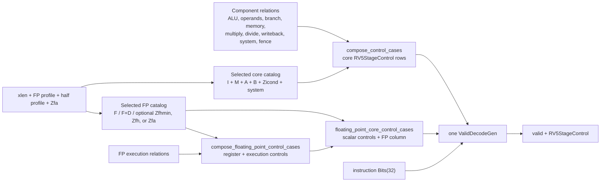

<!-- Explains how RV5Stage selects, composes, and validates its structured decode controls. -->

# RV5Stage decode

RV5Stage maps each selected instruction encoding directly to the structured
`RV5StageControl` consumed by the core. There is no intermediate
instruction-kind enum. Integer and floating-point rows are composed at host
elaboration time and emitted as one hardware decode relation for the selected
core profile. Pipeline behavior, hazards, and execution ordering belong to the
[parent RV5Stage contract](../README.md); this document owns the decode
composition and control-column boundaries.

## Select a decode specialization

`RV5StageInstructionDecoder` accepts `xlen`, `profile`, `half_precision`, and
the default-disabled `zfa` switch as host parameters. They select the
instruction catalogs before hardware is generated:

| Specialization | Selected rows |
|---|---|
| RV32, FP disabled | RV32I plus the RV32 forms of M, A, and B, followed by Zicond, Zicsr, Zifencei, and the supported privileged instructions |
| RV64, FP disabled | RV64I plus the RV64 forms of M, A, and B, followed by Zicond, Zicsr, Zifencei, and the supported privileged instructions |
| RV32F | The RV32 core rows plus the RV32F catalog |
| RV64D | The RV64 core rows plus the RV64F and RV64D catalogs |

RV5Stage deliberately accepts only disabled FP, RV32F, or RV64D. A half-precision
profile requires FP to be enabled. `Zfhmin` adds its load, store, move, and
conversion catalog, plus the D-to-H and H-to-D conversions for RV64D. `Zfh`
adds the XLEN-selected full Zfh catalog and those D conversions when the base
profile is RV64D. Zfa adds the selected S and D format operations, plus H
operations only for full Zfh; RV32D pair moves remain cataloged but unsupported
because RV5Stage does not implement RV32D. These lists are assembled by
`rv5stage_floating_point_instructions`; the matching execution cases are
assembled separately and then checked against the same selected instruction
domain.

The selection is specialization, not runtime dispatch. Each enabled
configuration contains one `ValidDecodeGen` over the combined core and FP rows.
With FP disabled, the prebuilt RV32 or RV64 core relation is selected instead.

## Follow a row from catalog to hardware



For a core instruction, `compose_control_cases` converts its canonical
`InstructionSpec` to an instruction pattern, finds exactly one output in every
component relation with `component_output`, and nests those outputs into one
`RV5StageControl` row. The row sets `floating_point_valid` false and leaves the
entire FP sub-bundle unconstrained.

For an FP instruction, [`fp-ctrl.rhdl`](fp-ctrl.rhdl) derives integer/FPR source
use and destination-bank selection from the instruction's operand metadata,
then joins that register control to the selected execution control. The
`floating_point_core_control_cases` adapter in
[`core-ctrl.rhdl`](core-ctrl.rhdl) integrates the result into
`RV5StageControl`: it sets `floating_point_valid`, supplies the scalar operand
and address-generation controls needed by FP memory operations, disables
unrelated branch, scalar-writeback, system, and fence actions, and leaves the
unused multiply/divide columns free. FP decode is therefore part of the core
control relation, not an independent runtime decoder.

`fp-ctrl.rhdl` also exports a standalone FP decoder for focused use, but
`RV5StageInstructionDecoder` composes its case lists directly and does not
instantiate that circuit beside the core decoder.

## Change the owning control column

Each component file owns both its decoder-facing bundle and the cases that
populate that column. Component files do not import sibling decode components;
`core-ctrl.rhdl` is the composition boundary.

| File | Owned control |
|---|---|
| [`alu-ctrl.rhdl`](alu-ctrl.rhdl) | ALU result selection and modifiers for base integer, B, Zicond, address-generation, and unused-result cases |
| [`operand-ctrl.rhdl`](operand-ctrl.rhdl) | Integer register use, ALU operand routing, and immediate format |
| [`branch-ctrl.rhdl`](branch-ctrl.rhdl) | Branch-resolver mode and JALR target selection |
| [`mem-ctrl.rhdl`](mem-ctrl.rhdl) | Load, store, LR/SC, and AMO operation, width, atomic operation, and load extension |
| [`multiply-ctrl.rhdl`](multiply-ctrl.rhdl) | Multiplier signedness plus high-result and word-result selection |
| [`divide-ctrl.rhdl`](divide-ctrl.rhdl) | Divider signedness plus quotient/remainder and word-result selection |
| [`writeback-ctrl.rhdl`](writeback-ctrl.rhdl) | Scalar architectural write enable and result source |
| [`system-ctrl.rhdl`](system-ctrl.rhdl) | Zicsr operation and ECALL, EBREAK, WFI, MRET, and SRET actions |
| [`fence-ctrl.rhdl`](fence-ctrl.rhdl) | FENCE, FENCE.I, and SFENCE.VMA actions |
| [`fp-ctrl.rhdl`](fp-ctrl.rhdl) | FP register-bank use, destination bank, execution unit, precisions, rounding-mode use, and operation modifiers |
| [`decode-support.rhdl`](decode-support.rhdl) | Catalog-independent case construction, exclusion, exact-pattern comparison, and component lookup helpers |
| [`core-ctrl.rhdl`](core-ctrl.rhdl) | `RV5StageControl`, core-row composition, scalar controls for FP rows, profile validation, and the integrated decoder circuit |

ALU and operand relations use each XLEN catalog's own immediate-shift
`InstructionSpec` objects because those encodings differ. Other shared
instructions reuse the same model objects; rows are matched by exact input
pattern rather than rebound by instruction name. Memory width is the shared
[`MemoryWidth`](../../load-store.rhdl) datapath contract, not a decoder-local
duplicate.

When adding an instruction, update the selected instruction catalog and every
complete component relation that participates in `compose_control_cases`. An FP
instruction instead needs operand metadata, an execution case, and inclusion
in the selected FP catalog; the core adapter owns its scalar-column settings.
Exact-one lookup turns a missing or duplicate component row into an elaboration
error.

## Read care masks and don't-cares

Decode rows state only what downstream hardware observes. `partial_pattern`
and `_` preserve omitted fields as care-mask zeros, so they remain synthesis
don't-cares when the columns are nested into `RV5StageControl`. They are not
software defaults:

- A store constrains its memory action and width but not load extension.
- A non-writing scalar instruction constrains write enable but not the unused
  writeback source.
- An inactive branch constrains the resolver enable but not inactive resolver
  modes or its unused target source.
- An instruction that does not consume an ALU result may leave the complete ALU
  column unconstrained.
- A core row leaves the FP sub-bundle unconstrained behind
  `floating_point_valid == false`; an FP row leaves its multiply/divide columns
  and unused control subfields unconstrained.

`ValidDecodeGen` preserves those nested care masks while producing the single
hardware relation. Its separate `valid` output distinguishes selected rows from
unmatched encodings; consumers must not interpret an unmatched control value as
a default instruction.

## Find implementation and tests

| Need | Start here |
|---|---|
| Integrated bundle, selected core catalogs, and final decoder | [`core-ctrl.rhdl`](core-ctrl.rhdl) |
| F/D/Zfhmin/Zfh catalogs and FP register/execution controls | [`fp-ctrl.rhdl`](fp-ctrl.rhdl) |
| Shared instruction pattern conversion | [`riscv/rtl/instruction-pattern.rhdl`](../../../riscv/rtl/instruction-pattern.rhdl) |
| ISA catalog definitions and profile enums | [`riscv/isa/`](../../../riscv/isa/) |
| Core use of decoded controls | [`core.rhdl`](../core.rhdl) |
| Integer-domain, column, care-mask, and bundle-shape checks | [`core-ctrl-test.rhm`](../tests/core-ctrl-test.rhm) |
| FP domains, operand metadata, profile composition, and single-decode checks | [`fp-ctrl-test.rhm`](../tests/fp-ctrl-test.rhm) |

Run the focused host checks from the repository root with one fresh compiled
root for the batch:

```sh
decode_compiled_root="$(mktemp -d)"
trap 'rm -rf "$decode_compiled_root"' EXIT
env PLTCOMPILEDROOTS="$decode_compiled_root" \
  tools/run-racket-tests.sh \
  cores/rv5stage/tests/core-ctrl-test.rhm \
  cores/rv5stage/tests/fp-ctrl-test.rhm
```

The core-control test checks exact selected RV32/RV64 domains, representative
component controls, nested care-mask preservation, the integrated bundle shape,
and design verification. The FP-control test checks F/D and optional Zfhmin/Zfh
domain composition, metadata-derived register controls, representative
precision and execution controls, supported profile pairs, design verification,
and the invariant that integrated enabled profiles elaborate one `rtl.decode`.
Use the [parent verification workflow](../README.md#verification) for broader
pipeline, CIRCT, and Verilator coverage.
