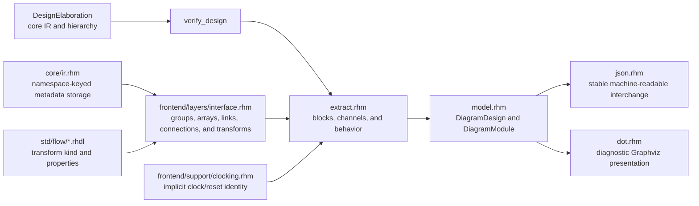

<!-- Describes Rhodium's read-only logical block and flow visualization package. -->

# Logical circuit diagrams

Use `rhodium/diagram` to inspect a verified `DesignElaboration` as logical
blocks and typed channels. The result is a read-only, tool-neutral projection,
not another hardware IR: changing or discarding it cannot change verification,
CIRCT lowering, or generated RTL.

## Generate a diagram

Import the package, extract the complete reachable hierarchy, and then select
the module that a consumer should inspect:

```rhombus
import lib("rhodium/diagram/main.rhm") open

def view = diagram(logical_design)
def top = view.module(logical_design.top.name)
def json = diagram_module_to_json(top)
def dot = diagram_module_to_dot(top)
```

`diagram(logical_design)` calls `verify_design` before extraction. It returns a
`DiagramDesign` containing the top module followed by every ordinary child
module reachable through `rtl.instance`. `view.module(name)` returns the first
matching `DiagramModule`, or `#false` when the hierarchy has no such module.

Use `diagram_to_json(view)` or `diagram_to_dot(view)` when all reachable modules
are wanted. `diagram_module(module_def)` is the lower-level single-module
extractor; it does not verify a design itself, so callers are responsible for
providing a module from an already verified design.

## Understand the ownership flow

The logical model combines verified IR facts with optional authoring intent.
Metadata enriches the view, but never replaces the IR as the source of hardware
connectivity.



Ownership is deliberately split:

- `rhodium/core/ir.rhm` owns generic `ModuleMetadata` storage. Core assigns no
  diagram meaning to a metadata namespace.
- `rhodium/frontend/layers/interface.rhm` owns interface groups, arrays,
  connections, transparent links, and transform descriptions.
- `rhodium/frontend/support/clocking.rhm` identifies the implicit ports created
  by `sync_circuit`.
- `rhodium/std/flow/*.rhdl` uses the interface-layer API to attach a transform
  kind, properties, and, when applicable, its implementing instance.
- `rhodium/diagram/extract.rhm` alone interprets those facts as a logical view.
  Backends ignore the metadata, and the extractor follows verified IR drivers
  for ordinary connectivity.

## Read blocks and hierarchy

A `DiagramModule` contains `blocks` and `channels`. Block `kind` describes the
logical role, while `behavior` independently records whether that role is a
`boundary`, `combinational`, or `sequential` implementation.

| Block kind | Extraction rule |
|---|---|
| `boundary` | One authored interface at the current module boundary. |
| `boundary-array` | One authored interface array, with indexed ports. |
| `input` / `output` | An ordinary ungrouped module port. |
| `instance` | An ordinary child instance not claimed as a flow transform's implementation. |
| `flow` | An interface transform described by frontend/library metadata. |
| `register` | An `rtl.register` or `rtl.register_reset`, with `next` and `current` ports. |

Flat directional interfaces remain one compound port, rather than separate
payload and handshake wires. Interface arrays preserve their element indices.
Nested interface members are expanded recursively so nested interface leaves
remain compound ports and ordinary leaf members remain ordinary ports.

Inline combinational operations have no block of their own. Extraction walks
backward through them when finding data dependencies, stopping at a rendered
block output or a state/hierarchy boundary. This keeps the view architectural
instead of expanding every primitive. Registers are the only primitive state
blocks rendered in this slice; other sequential operations still affect the
containing module's behavior classification.

An ordinary instance records its child module in `child_module`. A described
flow transform that wraps an implementation instance absorbs that instance as
one `flow` block and records the same link. The design view contains a separate
`DiagramModule` for each reachable child, but neither the logical model nor DOT
performs interactive hierarchy expansion.

Sequential behavior is derived from operation schemas in the verified IR. A
module is sequential when it directly contains a sequential operation or
recursively instantiates a module that does. That classification propagates to
ordinary instances and transform implementations. Merely declaring a
`sync_circuit` does not make a module sequential.

The implicit `clock` and `reset` ports introduced by `sync_circuit`, including
their child-instance connections, are omitted using sync-circuit metadata. An
ordinary `circuit` with explicitly authored `Clock` or `Reset` ports still
shows them; omission is not based on a port's name or type.

## Read channels

The model keeps protocol topology distinct from ordinary data dependence:

- `interface` channels come from recorded whole-interface connections. Their
  `protocol` retains the interface name and payload type, `protocol_family`
  retains the nominal interface type name, and `backpressured` records whether
  any member travels against the provider direction.
- `data` channels are inferred from verified place drivers and combinational
  operands between rendered terminals. They use `protocol_family: "data"` and
  are not backpressured.

Local `interface_link` handles are transparent. Extraction follows a connected
chain across those links and emits one interface channel between the surrounding
rendered terminals; the link does not become a wiring block. Duplicate logical
connections and connections internal to one block are suppressed.

Interface metadata says which flattened wires belong to one protocol and which
implementation represents a named transform. It is not a second netlist.
Ordinary data channels always come from the verified IR, and interface channels
are emitted only when their recorded endpoints resolve to rendered IR-backed
terminals.

## Consume the model or JSON

`rhodium/diagram/main.rhm` is the public entry point. It exports:

- the `DiagramPort`, `DiagramBlock`, `DiagramChannel`, `DiagramModule`, and
  `DiagramDesign` model classes;
- `diagram` and the lower-level `diagram_module` extractor;
- `diagram_to_json`, `diagram_module_to_json`, `diagram_to_dot`, and
  `diagram_module_to_dot`.

JSON is the stable machine-readable interchange. `diagram_to_json` emits one
object with `top` and `modules`; `diagram_module_to_json` emits one module
object. Each string ends with a newline. The serialized schema is:

| Object | Fields |
|---|---|
| module | `id`, `name`, `blocks`, `channels` |
| block | `id`, `label`, `kind`, `behavior`, `ports`, `properties`, and optional `child_module` |
| port | `id`, `name`, `direction`, `protocol`, `backpressured`, `compound` |
| channel | `id`, `source`, `destination`, `protocol`, `protocol_family`, `backpressured`, `kind` |
| endpoint | `block`, `port` |

Arrays preserve extraction order, and map keys are serialized deterministically.
Transform `properties` must contain JSON-serializable strings, booleans,
numbers, arrays, lists, or maps. IDs are references within one extracted view;
treat them as opaque and do not persist assumptions about their spelling or
numeric value across edits to the source design. The format currently has no
schema-version field, so consumers should reject missing required fields rather
than infer a different schema.

## Render diagnostic DOT

DOT is a compact presentation of the model, not a stable interchange format.
`diagram_module_to_dot` emits one left-to-right graph with the selected module
as a labeled cluster. `diagram_to_dot` concatenates one graph for each reachable
module.

Module inputs and outputs are labeled point anchors ranked at the left and right
cluster edges. Internal instances, registers, and flow transforms use
table-shaped nodes with named port cells. Sequential blocks have a light-gray
filled outer table; combinational blocks retain the plain table.

Only `interface` channels become DOT edges. Edges are unlabeled, and the nominal
protocol family controls the limited styling:

| Protocol family | DOT treatment |
|---|---|
| `Decoupled` and other default families | Solid edge. |
| `Irrevocable` / `IrrevocableCtrl` | Thick edge. |
| `Valid` | Dashed edge. |
| Any backpressured channel | Bidirectional edge with the reverse tail left open. |

Raw `data` channels remain available in the model and JSON but are deliberately
omitted from DOT. When a block combines compound flow ports with ordinary
ports, DOT draws short dotted stubs from the ordinary ports into empty space.
Map, map-valid, filter, filter-valid, gate, and demultiplex transforms add one
abstract `combo` input stub for their configured combinational logic.

## Find the implementation and examples

| File | Responsibility |
|---|---|
| [`model.rhm`](model.rhm) | Tool-neutral model and module lookup. |
| [`extract.rhm`](extract.rhm) | Verification entry point, hierarchy traversal, block extraction, channel tracing, and behavior classification. |
| [`json.rhm`](json.rhm) | Deterministic JSON serialization. |
| [`dot.rhm`](dot.rhm) | Port-anchored diagnostic DOT rendering. |
| [`main.rhm`](main.rhm) | Public re-export surface. |
| [`../../tests/frontend/diagram-test.rhm`](../../tests/frontend/diagram-test.rhm) | Model, hierarchy, JSON, DOT, protocol, implicit-control, and transparent-link coverage. |
| [`../../tests/backend/diagram-metadata-test.rhm`](../../tests/backend/diagram-metadata-test.rhm) | Proof that inspection metadata is absent from CIRCT output. |

The [RV5Stage example](../../examples/rv5stage/core-diagram.rhdl) elaborates the
RV64 core and selects its logical module. The
[wormhole-router example](../../examples/noc/wormhole-router-diagram.rhdl)
first requires a validated phased-XY routing plan, then extracts the configured
router. Both export their logical design, view, selected module, JSON, and DOT.

## Validate diagram changes

Run the focused diagram target for extraction, model, JSON, DOT, and package
boundary coverage:

```sh
make diagram-test
```

When changing metadata ownership or backend isolation, also run the focused
backend regression with a fresh compiled root:

```sh
diagram_compiled_root="$(mktemp -d)"
trap 'rm -rf "$diagram_compiled_root"' EXIT
PLTCOMPILEDROOTS="$diagram_compiled_root" \
  tools/run-racket-tests.sh tests/backend/diagram-metadata-test.rhm
```

## Deliberate limits

- The default model is logical, not a primitive operation netlist. Inline
  combinational logic and non-register state are not separately expandable.
- DOT has no interactive hierarchy expansion and intentionally omits ordinary
  data-dependency edges, type labels, and layout guarantees.
- Transform labels cover only transforms that call
  `describe_interface_transform`. An undescribed custom transform remains
  visible only through whatever underlying instances and connections it
  creates.
- The model carries no placement coordinates, timing, simulation activity,
  clock/reset-domain overlay, or physical RFPL geometry.
- User-authored grouping/collapse controls, a browser UI, optional overlays,
  and logical/physical composition are not implemented contracts.

[PLAN.md](PLAN.md) records possible incremental work. Its future items are
planning context, not promises made by the current API, JSON schema, or DOT
renderer.
