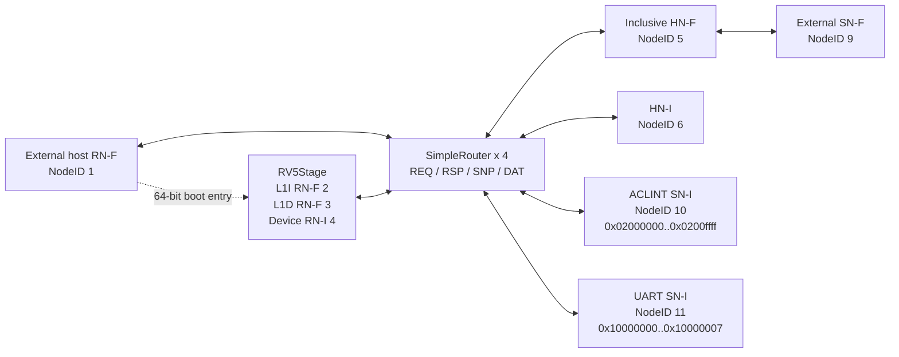
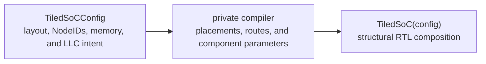

<!-- Documents the repository's concrete coherent SoC compositions and focused tests. -->

# SoC compositions

This directory owns synthesizable system composition: processor instances,
CHI endpoints and routing, Homes, platform devices, memory boundaries, and the
common host-facing interface. It does not own executable wrappers, DPI calls,
or simulator policy; those belong to the [`sims/` harnesses](../sims/README.md).

Start with the comparison below, then read the section for the selected system.
For component internals, follow the owning guides for
[RV5Stage](../cores/rv5stage/README.md), [CHI](../chi/README.md),
[NoC planning](../noc/README.md), and [platform devices](../devices/README.md)
instead of treating this page as a component catalog.

## Choose a system

| System | Default processors | Normal-memory termination | Coherence structure | Default core specialization | Best fit |
| --- | ---: | --- | --- | --- | --- |
| `SimpleSoC` | 1 | External line-capable SN-F; 1 GiB window | One 64-set, four-way inclusive LLC, one physical router, ACLINT, and UART | RV64IMAFDC plus B and Zicond | Primary single-core coherent system and external-memory integration |
| `MiniSoC` | 1 | Internal 64 KiB `CHIRam` | Forwarding HN-F, one physical router, ACLINT, and UART; 2 KiB direct-mapped L1I/L1D | Integer-only, compressed instructions disabled | Compact RTL and physical-design experiments |
| `TiledSoC` | 8 in the default 4x4 layout | Four internal 8 KiB `CHIRam` banks | Four inclusive LLC slices plus routed device-home, ACLINT, and UART tiles | Integer-only, compressed instructions enabled | Configurable multicore, striped-memory, and mesh experiments |

All three systems expose the same [`SoCHostInterface`](host-interface.rhdl): a
non-caching coherent RN-F memory port for loading and observation, plus a
64-bit boot-entry channel. `SimpleSoC` and `TiledSoC` accept an explicit
`~floating_point:` specialization and an orthogonal `~half_precision:`
specialization; the reusable `SimpleSoCFabric` also accepts both. `MiniSoC`
currently inherits that fabric's integer-only, non-compressed defaults.
`TiledSoC` keeps the integer-only floating-point default while enabling
compressed instructions, and `SimpleSoC` defaults to `FloatingPointProfile.D`
with compressed instructions enabled. Half precision defaults to disabled in
both compositions.

Every system also exposes the shared [`SoCUartInterface`](peripherals.rhdl)
containing RX, TX, and interrupt signals.

## Common host and platform contract

The external host loads and observes memory with coherent `ReadClean` and
`WriteUniquePtl` transactions, so its requests snoop private caches and
simulator mailboxes may live in ordinary coherent memory. It supplies the boot
entry directly to RV5Stage. No SoC contains FESVR behavior, DPI calls, or a
simulator-specific loader.

[`peripherals.rhdl`](peripherals.rhdl) defines both device windows, their
uncached and non-executable PMA entries, the HN-I subordinate map, and the UART
pin interface. The ACLINT occupies `0x02000000..0x0200ffff`. Its `mtime`
counter drives RV5Stage's `time` CSR, while each hart's MTIP and MSIP levels
drive the corresponding machine interrupt inputs. The UART occupies
`0x10000000..0x10000007`. Its interrupt is exposed but intentionally not wired
into RV5Stage until an external interrupt controller is present. The platform
currently advances `mtime` once per SoC clock; a later clock-rate adapter can
replace that explicit tick policy. Supervisor and external interrupt lines
therefore remain low.

## SimpleSoC

[`simple-soc.rhdl`](simple-soc.rhdl) composes the primary single-core coherent
system:



The RN-I, three RN-F, and two subordinate relationships reuse one physical
single-router topology but independently compile validation, route keys,
buffering, and allocation for the four CHI channel planes. REQ is 5-to-4, RSP
is 8-to-7, DAT is 9-to-9, and SNP is 1-to-3 because all three RN-Fs receive
snoops. Router arity therefore follows the permitted protocol paths instead of
an all-node cross product.

RV5Stage exposes ready-valid `CHIRNChannels` bundles directly at its hierarchy
boundary, so the SoC connects both cache endpoints to the NoC without internal
credited links. The blocking inclusive HN-F caches subordinate lines, snoops
coherent requesters before replacement, and writes dirty snoop data back to the
subordinate. The external SN-F must accept native 64-byte reads and writes, so
this direct path needs no fragmenter.

Device addresses instead leave RV5Stage through its uncached RN-I, cross the
HN-I, re-enter the same physical fabric through the Home's subordinate-side
attachment, and terminate at either the CHI-native ACLINT or UART SN-I
attachment. Both paths are derived from one physical-region table. Each region pairs
RISC-V read, write, execute, cacheability, and atomic attributes with its CHI
Home; the SoC derives the `CHIHomeMap` from those entries. Requests outside the
table therefore trap in RV5Stage instead of entering CHI without a Home.

`SimpleSoCFabric` factors the processor, Home module, NoC, ACLINT, and UART
from the final memory termination, and accepts that Home as an ordinary host
circuit parameter. `SimpleSoCParams` couples that fabric contract to the inclusive LLC
geometry. The default selects a 64-set, four-way blocking LLC and exports
line-capable `CHISNChannels` for SN-F NodeID 9 over the 1 GiB range
`0x80000000..0xbfffffff`. The SoC contains no RAM, fragmenter, or simulator
binding; an external subordinate owns memory contents and response timing.

## MiniSoC

[`mini-soc.rhdl`](mini-soc.rhdl) specializes `SimpleSoCFabric` as the small,
self-contained system used for compact RTL and physical-design experiments. It
uses a 64 KiB range, replaces the inclusive LLC with the forwarding `CHIHNF`,
and terminates the native memory boundary directly in an on-chip, line-capable
`CHIRam`. Its RV64 instruction and data caches are each explicitly 32-set,
one-way direct-mapped caches with 2 KiB of line storage; `SimpleSoC` retains
RV5Stage's default 64-set cache geometry.

## TiledSoC

TiledSoC exposes one author configuration and privately derives its network and
hardware parameters during elaboration:



The author-facing layout uses rows in visual north-to-south order and supports
compact runs of like tiles:

```rhm
def layout = tile_grid:
  row [llc(4)]
  row [host, device_home, aclint, uart]
  row [rv5stage(4)]
  row [rv5stage(4)]
```

`TiledSoCConfig` combines that immutable `TileGrid` with `TiledNodeIds`,
`StripedMemory`, `LLCGeometry`, and the CHI flit parameters. The public
`TiledSoC(config)` circuit accepts this author value directly. Its private
compiler derives mesh coordinates, occurrence ordering, endpoint IDs, CHI
relationships, routes, the shared physical-link manifest, and all component
parameters in one pass. There is no public intermediate TiledSoC plan or
second compiled configuration for authors to manage. The default
`default_tiled_soc_config` preserves the repository's 4x4 system, while the
focused hierarchy test also elaborates a 2x4 system through the same entrypoint.

The package lives under [`tiled-soc/`](tiled-soc/): `main.rhdl` is the public
entrypoint, `layout.rhm` owns the immutable configuration and macro-phase
tile-grid language, `compile.rhdl` owns private derivation, and `tiles/` owns
the concrete tile implementations.

The default layout places eight `RV5StageTile`s in the lower two rows, four
service routers in the middle row, and four `LLCTile`s in the upper row.
The middle row contains the external host RN-F, a `DeviceHomeTile` with both
sides of the shared HN-I, an `AclintTile`, and a `UartTile`. The HN subordinate
side reaches both device SN-Is through the same CHI mesh rather than direct
wires. The system allocates 16 RN-F NodeIDs for the eight L1I/L1D pairs, eight
RN-I NodeIDs for
uncached device traffic, one host RN-F, four HN-Fs, one HN-I, four SN-Fs, one
ACLINT SN-I, and one UART SN-I.

Four 8 KiB banks cover `0x80000000` through `0x80007fff` with 64-byte
cache-line striping. Each LLC tile contains a 16-set, four-way cache, giving
4 KiB per bank and 16 KiB of aggregate inclusive LLC capacity. One shared
physical-region table maps successive lines to successive HN-Fs and derives
the CHI Home map. Each LLC indexes its sets with the dense per-bank projected
address while retaining the complete global line address as its tag. Its
subordinate projector then maps sparse global bank addresses into the dense
local backing RAM before fragmentation. The 16 coherent requester endpoints
plus the host RN-F connect to all four HN-Fs, while the eight uncached
requester endpoints connect to the device HN-I and its subordinate side
connects to both SN-Is. Together they compile 78 REQ, 154 RSP, 68 SNP, and 156
DAT routes before any hardware elaborates.

Each tile owns one `CHIRouter`, containing independent REQ/RSP/SNP/DAT
`SimpleRouterFamily` instances and site-keyed CHI adapters. Every RV5Stage tile
uses one shared RTL specialization, every LLC tile uses another, and the
service row adds one `DeviceHomeTile`, one `AclintTile`, one `UartTile`, and
one `HostTile` specialization. Their implementations and parameter contracts
live under [`tiled-soc/tiles/`](tiled-soc/tiles/). The parent drives one constant
identity bundle per occurrence containing its router site, hart ID, endpoint
NodeIDs, striped service base, and local RAM base; tiles contain no system-wide
identity table or runtime routing-mode selector. A `RV5StageTile` attaches one
RV5Stage's two RN-F ports and its RN-I device port. A
`LLCTile` attaches one blocking `CHIInclusiveHNF` and keeps its address
projector, transfer fragmenter, and `CHIRam` on the HN's direct subordinate
side. The device HN-I is reachable only through the uncached RN-I routes. The
ACLINT's MSIP and MTIP vectors and shared `mtime` value return directly to
their corresponding RV5Stage tiles, while the UART tile passes its serial
boundary to the SoC.

Every tile exposes the family's uniform maximum of four incoming and four
outgoing physical links, each bundling the independent REQ/RSP/SNP/DAT
transports. `TiledSoC` alone applies the compiled
`RouterFamilyLinkConnection` manifest and explicitly closes unused edge and
corner slots. There is no whole-network RTL wrapper under `noc/`.

## Focused validation

Run every SoC configuration-compilation, tile, and hierarchy test from the
repository root with:

```sh
make soc-test
```

Use package-local targets when iterating on one area:

```sh
make -C socs rtl-elaboration-test
make -C socs tiled-compile-test
make -C socs tiled-elaboration-test
```

The focused SimpleSoC and MiniSoC elaboration tests cover the external-channel
and internal-memory variants. The tiled targets cover configuration compilation,
tile structure, and complete hierarchy elaboration. Executable build, run,
smoke, and lowering workflows belong to the [`sims/` guide](../sims/README.md).
