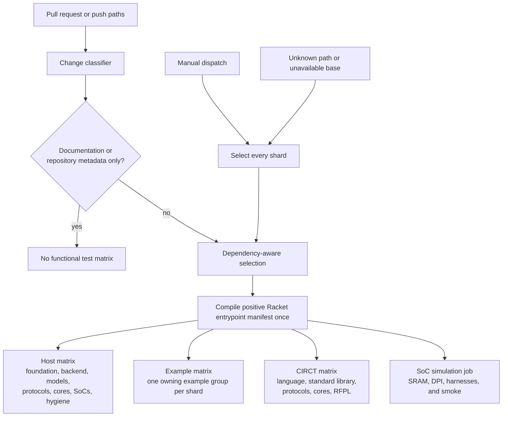

<!-- Documents Rhodium's mirrored test organization and focused verification commands. -->

# Rhodium tests

Choose validation in two steps: start with the package that owns the change,
then add only the deeper toolchain stage needed to test its observable effect.
The root [`Makefile`](../Makefile) defines the aggregate targets; package guides
own narrower workflows and evolving fixture details.

## Start with the change owner

The central test tree mirrors Rhodium's implementation boundaries:

| Directory | Scope | Focused target |
|---|---|---|
| [`core/`](core/) | Backend-independent types, IR construction, verification, and primitive semantics | `make frontend-test` |
| [`analysis/`](analysis/) | Optional backend-independent analyses over completed core IR | `make analysis-test` |
| [`frontend/`](frontend/) | Language profiles, layers, elaboration, examples, and invalid frontend uses | `make frontend-test` |
| [`backend/`](backend/README.md) | Host-side CIRCT emission tests, external fixtures, Verilog goldens, and Verilator benches | `make backend-test` |
| [`formal/`](formal/) | Optional Rosette semantics, queries, witnesses, and differential replay | `make formal-test` |
| [`emacs/`](emacs/) | Project-aware `rhodium-mode` dispatch and Racket back-end configuration | `make emacs-test` |

`make frontend-test` deliberately combines core, analysis, and frontend tests,
then exercises the intentional failures in `frontend/invalid/`. Use
`make analysis-test` when an analysis-only change does not need that wider
surface. `make backend-test` runs Rhombus tests for emission, diagnostics, and
backend policy; it does not invoke CIRCT or Verilator.

Tests for libraries and systems live with their owning packages rather than in
this mirrored tree:

| Change area | Host or package target | Owning guide |
|---|---|---|
| Language-layer equivalence | `make lop-test` | [Frontend](../rhodium/frontend/README.md) |
| Logical diagrams | `make diagram-test` | [Diagrams](../rhodium/diagram/README.md) |
| RFPL views and constraints | `make rfpl-test` | [RFPL](../rfpl/README.md) |
| Pure NoC model and hardware planning | `make noc-test` | [NoC](../noc/README.md) |
| RISC-V model and instruction catalogs | `make riscv-test` | [RISC-V](../riscv/README.md) |
| Platform devices | `make device-test` | [Devices](../devices/README.md) |
| CHI protocol and invalid connections | `make chi-test` | [CHI](../chi/README.md) |
| SoC composition and planning | `make soc-test` | [SoCs](../socs/README.md) |
| HardFloat host semantics | `make hardfloat-host-test` | [HardFloat](../hardfloat/README.md) |
| Reusable processor components and RV5Stage | `make rv5stage-host-test` | [Cores](../cores/README.md) and [RV5Stage](../cores/rv5stage/README.md) |

Canonical valid authoring programs live under
[`../examples/`](../examples/README.md). Select the matching example group
instead of sweeping every example:

| Area | Target |
|---|---|
| Built-in language | `make examples-rhodium` |
| Clocking analysis | `make examples-clocking` |
| Standard library | `make examples-std` |
| NoC | `make examples-noc` |
| Authoring-layer comparisons | `make examples-lop` |
| RFPL | `make examples-rfpl` |
| RISC-V | `make examples-riscv` |
| CHI | `make examples-chi` |
| Processor components | `make examples-cores` |
| RV5Stage | `make examples-rv5stage` |

`make examples` runs every non-formal example. The optional Rosette example has
its own `make examples-formal` target. Use `make check-example-verilog` when the
only question is whether example designs have valid reference exports and
backend-manifest coverage; that check does not invoke CIRCT or Verilator.

## Increase validation depth deliberately

### Host and model checks

For one Racket or Rhombus test, use the repository wrapper so the run receives
the required isolated compiled root:

```sh
tools/run-racket-tests.sh tests/core/verify-test.rhm
tools/run-racket-tests.sh tests/frontend/interface-test.rhm
tools/run-racket-tests.sh tests/backend/circt-test.rhm
```

Then move to the owning target from the tables above. Add
`make check-boundaries` after moving modules or changing dependency direction.
These checks do not require CIRCT or Verilator. Some package targets can still
exercise ordinary native helpers; for example, `make device-test` includes the
standalone UART DPI C++ check.

### External CIRCT and Verilator checks

Use external checks when a change can affect CIRCT MLIR, generated
SystemVerilog, or runtime hardware behavior. The backend runner owns fixture
selection, grouping, tool discovery, exact-reference policy, artifacts, and
expected-failure simulations; see the [backend test guide](backend/README.md).

| Target | External work |
|---|---|
| `make circt-verify-test` | Lower the curated backend spine through CIRCT without golden comparison or simulation |
| `make circt-test` | Lower the curated spine, compare eligible references, and run available Verilator simulations |
| `make verilator-test` | Lower and simulate the curated fixtures that have benches, without golden comparison |
| `make verilog-golden-test` | Compare every example-backed fixture with its exact reference using the pinned CIRCT version |
| `make circt-full-test` | Lower every backend-manifest fixture, compare all eligible references, and run every available backend-manifest simulation |
| `make rfpl-circt-test` | Run RFPL's separately owned CIRCT and Verilog-reference fixture |
| `make hardfloat-circt-test` | Run HardFloat's separately owned CIRCT and Verilator fixtures |
| `make rv5stage-test` | Run RV5Stage host checks, then its focused backend fixture set |

For one backend fixture, use `FIXTURE=name`; for a small batch, use the
space-separated `FIXTURES` selector:

```sh
FIXTURE=bundle bash tests/backend/run-circt.sh
FIXTURES='bundle interface-array' bash tests/backend/run-circt.sh
```

Do not copy the changing fixture catalog here. The manifest and all supported
selectors and modes are documented in
[`backend/README.md`](backend/README.md#choose-the-smallest-useful-run).

Executable FESVR transport, DPI binding, reusable SoC simulators, and mapped
MiniSoC smoke tests are a separate external-toolchain boundary owned by the
[simulation guide](../sims/README.md), not by the backend fixture runner.

### Optional formal checks

Formal validation is solver-backed and remains outside ordinary host and
the broad `make test` aggregate:

| Target | Work performed |
|---|---|
| `make formal-test` | Probe Rosette and Z3, then run the formal API, semantics, reachability, property, witness, and fail-closed suite |
| `make examples-formal` | Run the optional formal example |
| `make formal-differential-test` | Replay selected formal models independently through CIRCT and Verilator |

The [formal guide](../rhodium/formal/README.md) owns supported semantics,
dependency versions, and troubleshooting.

### Aggregate targets

Use aggregate targets only when the change spans their full scope:

| Target | Scope |
|---|---|
| `make unit-test` | Core, analysis, frontend, invalid-frontend, and backend host tests |
| `make host-checks` | Host tests, package models, protocols, cores, SoCs, and repository hygiene without the explicit example sweep |
| `make host-test` | `host-checks` plus every non-formal example |
| `make test` | `host-test`, the curated backend CIRCT spine, RFPL CIRCT, and HardFloat CIRCT/Verilator checks |

`make test` is the broad repository aggregate, not an exhaustive superset. It
excludes the optional formal and Emacs suites, the full backend manifest, and
executable SoC simulation. Run those owners explicitly when the change requires
them.

## CI ownership

CI first tests and applies [`tools/ci-changes.sh`](../tools/ci-changes.sh). When
it selects any downstream work, CI compiles the positive Racket entrypoint
manifest once for reuse by the selected jobs. Pull requests and pushes classify
the changed paths; manual dispatch selects every matrix shard.



Known dependency paths can select several branches. For example, NoC, RISC-V,
CHI, core, and shared-standard-library changes also select the SoC host shard
when their behavior feeds system composition. Backend implementation or fixture
changes select the backend host shard and every external CIRCT group.
The simulation job remains independent from backend fixtures and owns the
repository's full harness flow.

Recognized documentation and inert repository metadata select no functional
test jobs. The optional Emacs integration and most of `vlsi/` have no
functional CI lane;
Rhodium sources there still receive source hygiene, while `vlsi/sim/` and the
mapped MiniSoC flow select simulation. Unrecognized paths fail closed by
selecting every job, and the classifier audit rejects tracked executable source
that selects no job.

## Testing principles

- Test supported behavior and invalid uses of supported features.
- Prefer semantic structure, opcodes, and types over generated temporary names.
- Use language-layer equivalence tests when syntax should lower to existing
  kernel or core meaning.
- Update Verilog references only when backend output changes intentionally, and
  review the example-source diff.
- Keep generated Racket, CIRCT, SystemVerilog, and Verilator output out of
  version control.
- Reserve broader suites for cross-layer, shared-infrastructure, or complete
  backend-pipeline changes.
